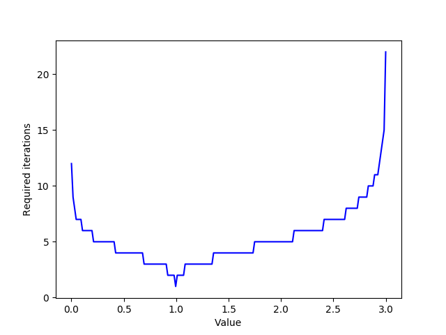

# CS416 Programming Assignment 1

This assignment consists of several parts. Each part includes an implementation component and several questions to answer. Modify this README file with your answers. Only modify the specified files in the specified way. Other changes will break the programs and/or testing infrastructure.

You are encouraged to develop and perform correctness testing on the platform of your choice, but you should answer the questions below based on your testing on the *ada* cluster, and specifically the compute nodes of the cluster (which have more cores than the head node). Recall that you don't access the compute nodes directly, instead you submit jobs to the queueing system (SLURM) which executes jobs on your behalf. Thus you will test your program by submitting cluster jobs and reviewing the output.

## Getting Started

1. Connect to *ada* via `ssh username@ada.middlebury.edu` (if you are off-campus you will need to use the VPN), logging in with your regular Middlebury username and password (i.e. replace `username` with your username).

    When you connect to *ada* you are logging into the cluster "head" node. You should use this node for compilation, interacting with GitHub, and other "administrative" tasks, but all testing will occur via submitting jobs to the cluster's queueing system.

2. Clone the assignment skeleton from GitHub to *ada* or copy from the files from your local computer.

3. Load the CS416 environment by executing the following:

    ```
    module use /home/mlinderman/modules/modulefiles
    module load cs416/s23
    ```

    These commands configure the environment so that you can access the tools we use in class. You will need to execute these commands every time you log in. Doing so is tedious, so instead you can add the two lines your `.bash_profile` file (at `~/.bash_profile`) so they execute every time you login.

4. Prepare the skeleton for compilation

    In the root directory of the skeleton, prepare for compilation by invoking `cmake3 .`. Note the *3*. You will need to explicitly invoke `cmake3` on *ada* to get the correct version, on other computers it will just be `cmake`. You only need to do this once.

5. Change to the assignment directory and compile the assignment programs

    ```
    cd pa1
    make
    ```

6. Submit a job to the cluster to test your programs

    The assignment directory includes `ada-submit`, a starter submission script. Modify this BASH script to invoke your assignment programs for testing. In the following example I submitted the script with the `sbatch` command. SLURM (the cluster job queueing system) responded that it created job 4238.
    
    ```
    [mlinderman@ada pa1]$ sbatch ada-submit 
    Submitted batch job 4238
    ```

    I then checked the cluster status to see if that job is running (or pending). If you don't see your job listed, it has already completed. 

    ```
    [mlinderman@ada pa1]$ squeue
             JOBID PARTITION     NAME     USER ST       TIME  NODES NODELIST(REASON)
              4238     short      pa1 mlinderm  R       0:09      1 node004
    ```

    And when it is done, I reviewed the results by examining the output file `pa1-4238.out` created by SLURM (i.e. `pa1-<JOB ID>.out`). Review the guide on Canvas for more details on working with *ada*.

Each subsequent time you work on the assignment you will need start with steps 1 and 3 above, then recompile the test program(s) and resubmit your cluster job each time you change your program.

## Part 1: Mandelbrot images or 2-D parallelism

### Introduction

The `mandlebrot-main` program will generate `mandelbrot-serial.ppm`, a fractal image visualizing the Mandelbrot set. Most platforms should have a PPM viewer. When using *ada* you will need to copy the images back to your local computer to view them. Each pixel corresponds to a point in the complex plane, with the brightness proportional to the difficulty (computational cost) of determining whether that point is contained in the Mandelbrot set.


Assuming you have run CMake in the root directory, you can compile your programs with `make mandelbrot-main`. The main program will automatically check the correctness of each implementation, printing out the first indexes (and values) where your implementation is not sufficiently close to the reference implementation. You will not be able to run the "next" function until the preceding is correct.

### Implementation

#### Using C++ threads

In the `MandelbrotThreads` function in <mandelbrot.cc>, implement the Mandelbrot image generation using exactly `num_threads` [C++ threads](http://www.cplusplus.com/reference/thread/thread/), including the "master" thread (i.e. the caller should be able set `num_threads` to any value and your code should work correctly). Do not re-implement the Mandelbrot computation itself, instead your threaded implementation should ultimately call `MandelbrotSerial` in each thread. 

Recall that you launch a C++ thread by constructing a `std::thread` object with a function you want to execute in that thread and any arguments to be provided to that function. `MandelbrotThreads` should be fully self-contained, i.e. it should launch and join all threads before returning. Your solution should use a static work allocation and not require any synchronization.

The following example, adapted from the `[cplusplus.com](http://www.cplusplus.com/reference/thread/thread/) shows an example creating two threads in addition to the "master" thread.

```cpp
#include <thread>
 
void Foo()  {
  // do stuff...
}

void Bar(int x) {
  // do stuff...
}

int main() {
  std::thread threads[2];
  threads[0] = std::thread(foo);     // Spawn new thread that calls foo()
  threads[1] = std::thread(bar, 0);  // Spawn new thread that calls bar(0)

  // Foo, Bar and this function are now executing concurrently

  // Synchronize threads:
  threads[0].join();  // Pauses until "Foo" thread finishes
  threads[1].join();  // pauses until "Bar" thread finishes

  return 0;
}
```

The skeleton contains an implementation with two threads where each thread computes half the image (i.e. the bottom or the top half). Start by extending this implementation to work with any number of threads (as described above), partitioning the image accordingly. After you have successfully implemented `MandelbrotThreads`, test it with different numbers of threads by changing the `--threads` command line option, e.g.

```
./mandelbrot-main --threads 2
```

then answer the questions below.

#### Using ISPC to target the SIMD execution units and processor cores

While your threaded program could exploit multiple cores, it does not take advantage of the processor's SIMD execution units. And in fact, for several programs we use a compiler `#pragma` to prevent the compiler from automatically generating vectorized code for the serial implementation (to a have a truly serial baseline for benchmarking purposes). Our goal is to use IPSC, the [Intel SPMD Program Compiler](https://ispc.github.io), to simultaneously exploit the SIMD execution unit and multiple cores!

Above you explicitly created threads and assigned work to those threads (an *imperative* approach). With ISPC you will instead describe what computations are independent; ISPC will be responsible for mapping those computations to the available computational resources (a *declarative* approach).

The `mandelbrot.ispc` file includes an implementation, `MandelbrotISPC` for generating the Mandelbrot image in the IPSC language. While this looks like C/C++ code, it is not. This file is compiled by ipsc to generate executable code that can be called from a C++ program. The `export` keyword indicates that this function should be callable from the C++ application code. 

Recall that the IPSC execution model is very different. In the SPMD model, multiple instances of a program are executed in parallel on different data. Here multiple instances of the ISPC program are executed in parallel on the processor's SIMD execution units. ISPC calls this group of concurrently running program instances a "gang". The number of these instances is determined at compiler time (and is chosen to match the vector width of the SIMD unit, e.g. 8). You can access the number of instances in the gang with the special `programCount` variable and each instance's unique index in the gang via the `programIndex` variable. You can think of the call from C++ to the ISPC as spawning `programCount` concurrent program instances. The gang of instances run the program to completion and then control returns back to the calling C++ code.

The ISPC code below (from the ISPC documentation) interleaves computing each array element across the program instances.

```cpp
for (uniform int i = 0; i < count; i += programCount) {
    float d = data[i + programIndex];
    float r = ....
    result[i + programIndex] = r;
}
```

The code above explicitly maps the iteration space to specific program instances. Instead it is more concise, and more powerful, to declaratively express what computations are independent and thus could be executed concurrently. And then let the compiler decide how to map the iteration space to specific program instances. The `foreach` loop used in the skeleton does the latter.

Before proceeding, review the ISPC language constructs by reading through the [documentation](https://ispc.github.io/documentation.html) and particularly the [example walkthrough](https://ispc.github.io/example.html), which is similar to the problem we are working on here.

Run the benchmark program. What do you observe about the ISPC implementation? Make sure to answer the questions below.

So far the ISPC implementation is only using one core. We can use ISPC tasks to take advantage of multiple cores. The `MandelbrotISPCTasks` function uses the `launch[1]` keyword to launch a single Mandelbrot task that computes the entire image. Adapt this function to launch an arbitrary number of tasks, each of which computes a different region of the image. Just as `foreach` specifies which computations are independent and can be performed by different program instances, `launch` specifies which tasks are independent and can executed on different cores.

After you have re-implemented the `MandelbrotISPCTasks` function successfully, experiment with different values for the `--tasks` command line option, i.e.

```
./mandelbrot-main --tasks 8
```

to run the program. By thoughtfully setting the number of tasks you should be able to achieve a many fold speedup! As above, make sure to answer the questions below.

### What to turn in for this part

You should have modified the `MandelbrotThreads` function in `mandelbrot.cc` and the `MandelbrotISPCTasks` function in `mandelbrot.ispc`. The test program should run to completion without reporting any errors. Answer the following questions by editing this README (i.e. place your answer after the question, update any tables, etc.). Your answers should be on the order of several sentences. Some questions may require you to revisit your implementation.

1. Fill in the following table with the speedup you observed on *ada* for your threaded implementation. Do you observe effectively linear speedup? In your answer hypothesize why you observe the speedups that you do, especially for small numbers of cores. As a hint, the data point for 3 cores can be particularly informative. 

 ``` ANSWER
    This is a not a linear speedup, it is more of a logarithmic speedup (when graphing the points (x = cores, y = speedup) it looked to resemble a 4.5*log(x) line). This occurs because the Mandelbrot set has different color complexities (in our case white or black) based on their computatinal cost. Since this image is not symetrical once it is split into more planes than two, the time that it takes to compute each thread will be different. This is exposed by the 3, because the middle of the Mandlebrot set is more difficult to compute than the edges, so the x3 speedup is actually larger than the x2. 
```
 

    *** Seen in pa1-111892.out ***

    | Cores | Speedup |
    | ----- | ------- |
    | 1     | 1.000X  |
    | 2     | 1.959X  |
    | 3     | 1.610X  |
    | 4     | 2.356X  |
    | 8     | 3.832X  |
    | 18    | 5.624X  |
    | 36    | 6.404X  |

2. To investigate your hypothesis, measure the amount of time each thread spends to compute its portion of the image. You can do so by inserting timing code at the beginning and end of your worker function, e.g.
    ```cpp
    double startTime = CycleTimer::currentSeconds();
    ...
    double endTime = CycleTimer::currentSeconds();
    ```
    How do your measurements explain your speedup results?

    ``` 
    ANSWER

    ** Note, the manelbrot-main runs each 3 times, so had to insert ID to figure out which were apart of the same run ** 

    *** Time Output seen in pa1-111895.out ***
   
    When adding the timing, it was evident that for the 2 threads, the amount of work was fairly even (because symmetrical), but when the three threads were computing, the middle image thread took way longer to complete (~0.3 for middle, ~0.1 for edges). This fact confirms our initial hypothesis that the work on each thread is not evenly distributed so it takes longer for 3 threads than 2.  
    ```

3. You should be able to achieve a speedup **>7X** with 8 threads on a single *ada* node. If your implementation already does so you are done. If not, revise your static work decomposition (which should work for any number of threads) to achieve the specified performance level. How did you change your work decomposition? Report your final speedup for 8 threads.


    *** Seen in pa1-111901.out ***
    | Cores | Speedup |
    | ----- | ------- |
    | 8     |  7.022X |

    ```
    *** ANSWER ***
    The orginal decomposition was to break the work into chunks based on num_threads, however after an analysis in question 1&2 we saw that this didn't work because of an uneven work distribution. So, instead of breaking into chunks, instead we would do line by line computation such that the total number of lines assigned to each thread is even, however it is more evenly distributed throughout the image. So instead of the image being split like 111,222,333 it is 123,123,123 (lines)
    ```


4. The ISPC compiler is configured for 8-wide AVX2 instructions. What is the ideal speedup would you expect for the ISPC code (without tasks). Why might your results be less than ideal? Consider what characteristics of this computation might limit SIMD performance.

    ```
    *** ANSWER ***
    The ideal speedup for an ISPC compiler configured for 8-wide AVX2 instruction would be x8 because you could divide the work into 8 different processors. However, it is difficult to speed up to the full maount because there are micro load imblances in the SIMD performace. When executing, the vector being computed is only as fast as its slowest operation, so it must wait until all computations are finished to move to the next vector. Therefore, it is not perfectly vecotrizable and will not reach the full x8 speedup expected. 
    ```

5. Experiment with different numbers of tasks. Report the best speedup you achieved and the number of tasks. Why do you think that number of tasks was best?

    ```
    *** ANSWER ***
    I experimented with values in increments from 36 to 256 and foudn that the maxium value being around 210 tasks and 81.851X speedup. This can be seen in the pa1-111985.out file. I think that this number (or around this number) is the best because it is using all the computational power it can with 36 cores and using a vectorized computational appraoch because of the ISCP implementation 
    ```

## Part 2: Sqrt

### Introduction

The `sqrt.cc` file contains an iterative implementation for `sqrt`. To avoid division (which can be very slow), we actually compute the reciprocal square root of $$S$$ by solving the equation $$\frac{1}{x^2}-S=0$$ using [Newton's method for root-finding method](https://en.wikipedia.org/wiki/Methods_of_computing_square_roots#Iterative_methods_for_reciprocal_square_roots). The iterative relation is $$x_{i+1}=\frac{x_i}{2}(3-Sx_{i}^{2})$$. The figure below shows the number of iterations required to converge to a specific accuracy for inputs in the range 0-3 (this implementation does not converge for inputs outside of that range) with an initial guess of 1.0. Notice that the number of iterations required grows when the initial guess is less accurate.



You can compile this part with `make sqrt-main`.

### Implementation

#### Good and Bad Inputs

The skeleton provides a serial implementation as well ISPC implementations with and without tasks. Experiment with these implementations and then answer the questions below.

#### Intel SIMD intrinsics

Now that you have some experience targeting the processor's SIMD execution units using ISPC, we are going to do the same but with the compiler's SIMD intrinsics. Recall that compiler intrinsics are treated like functions but directly map to processor instructions. 

In the `SqrtIntrinsics` function in `sqrt.cc`, implement the `sqrt` computation using Intel SIMD intrinsics. We are targeting the AVX2 extensions, which provide 256-bit vectors (i.e. 8 32-bit `float`s). The `__m256` represents 8-wide vector of floats. Add the `--intrinsics` argument so that the `main` function will benchmark your function and test it for correctness, i.e., `./sqrt-main --intrinsics`.  You should not use the AVX-512 extensions. **You are not permitted to use any of the sqrt intrinsics, e.g. `_mm256_rsqrt_ps`.**

Check out the [Intel Instrinsics Guide](https://software.intel.com/sites/landingpage/IntrinsicsGuide/) for a searchable list of intrinsic functions you can use in your code. The skeleton includes some helper functions that may useful to you. There are many possible solutions, but as a starting point attempt to directly translate the serial code into the corresponding intrinsic functions. Your solution will still need to include C++ control flow, e.g. a `while` loop.

Make sure to answer the questions below.

### What to turn in for this part

You should have modified the `SqrtIntrinsics` function in `sqrt.cc`. The test program should run to completion without reporting any errors. Answer the following questions by editing this README (i.e. place your answer after the question, update any tables, etc.). Your answers should be on the order of several sentences. Some questions may require you to revisit your implementation.

1. Report speedups vs. the sequential implementation you obtain for both ISPC implementations when using all the cores for the random input.

    | Implementation  | Speedup |
    | --------------- | ------- |
    | ISPC            |         |
    | ISPC with tasks |         |

2. Modify the inputs generated in the `sqrt-main.cc` test program (look for the TODO) to obtain the **best** possible speedup for the ISPC implementation (without tasks). Report the speedups you obtained. Describe the input you identified and briefly explain why the ISPC implementations are faster for that input.

    | Implementation  | Speedup |
    | --------------- | ------- |
    | ISPC            |         |

3. Modify the inputs generated in the `sqrt-main.cc` test program (look for the TODO)  to obtain the **worst** possible speedup for the ISPC implementation (with tasks). Report the speedups you obtained. Describe the input you identified and briefly explain why the ISPC implementations are less efficient for that input.

    | Implementation  | Speedup |
    | --------------- | ------- |
    | ISPC            |         |

4. Report the speedup for your intrinsic implementation compared to the serial implementation for the random input. To get full credit your implementation should have similar or better performance than the ISPC implementation.

    | Implementation  | Speedup |
    | --------------- | ------- |
    | ISPC            |         |
    | Intrinsics      |         |

5. *Bonus competition* Recall that SIMD control flow is implemented with masking. ISPC masks the computations in the inner "while" loop once the specified tolerance is reached. Is that masking needed? Attempt to improve the performance of the ISPC implementation by optimizing the masking. As a hint, investigate the [`unmasked` block`](https://ispc.github.io/ispc.html#re-establishing-the-execution-mask) in the ISPC language. Gradescope will record the execution time for the your ISPC implementation and the performance will be subsequently evaluated on Ada. The fastest implementation will win a prize! 

## Part 3: SAXPY

### Introduction

SAXPY is a level-1 routine in the widely used and heavily optimized BLAS (Basic Linear Algebra Subproblems) library. BLAS provides functions for a variety of linear algebra operations. SAXPY implements "Single precision A*X+Y" where A is a scalar and X and Y are arrays. Our implementation performs SAXPY on 20 million elements.

You can compile this part with `make saxpy-main`.

### Implementation

#### Using ISPC to target the SIMD execution units and processor cores

In `saxpy.ispc` implement the `SaxpyISPCTask` and `SaxpyISPCTasks` functions to create an ISPC implementation with tasks. Your implementations will look similar to our previous ISPC implementations. Your task-based implementation should use the specified number of tasks. After you have implemented these functions successfully, experiment with different values for the `--tasks` command line option, e.g.

```
./saxpy-main --tasks 8
```

### What to turn in for this part

You should have modified the he `SaxpyISPCTask` and `SaxpyISPCTasks` functions  in `saxpy.ispc`. The test program should run to completion without reporting any errors. Answer the following questions by editing this README (i.e. place your answer after the question, update any tables, etc.). Your answers should be on the order of several sentences.

1. Run SAXPY with different number of tasks. What kind of speedups relative to the serial implementation do you observe? Do you think it would be possible to re-implement SAXPY to get (near) linear speedup? As a hint, think about what might be the limiting aspect of this computation? Is the limit the arithmetic throughput (how many arithmetic operations the processor can perform), memory bandwidth of something else?

2. We implement SAXPY to overwrite one of the inputs with the result values (this is the interface used by the optimized BLAS library). If we changed the interface to have a distinct result array, do you think speedups would increase or decrease? Make you answer quantitative by comparing the FLOP/byte, i.e. the "arithmetic intensity" of the two implementations. As a hint, the distinct result array implementation will load from or store to memory a total of `4 * n * sizeof(float)` bytes or `4 * sizeof(float)` bytes per iteration (the 4 is not a typo, think about how caches work under a write-allocate model).

## Grading

Assessment | Requirements
-------|--------
**N**eeds revision | Some but not all components compile. Some but not all components are correct, or some but not all questions are answered *except* the intrinsic implementation for Sqrt.
**M**eets Expectations | All components (Mandelbot, Sqrt and Saxpy) are correct, you meet the specified performance targets and your answers to the embedded questions meet expectations *except* the intrinsic implementation for Sqrt.
**E**emplary | All requirements for *Meets Expectations* and the intrinsic implementation for Sqrt is correct and meets specified performance targets.

### Acknowledgements

This assignment was adapted from a course taught by Kayvon Fatahalian and Kunle Olukotun.

    

